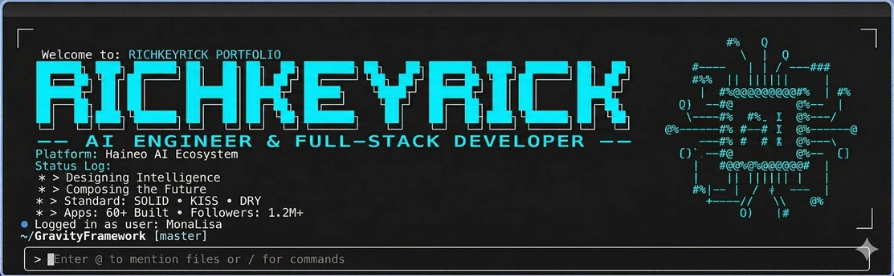
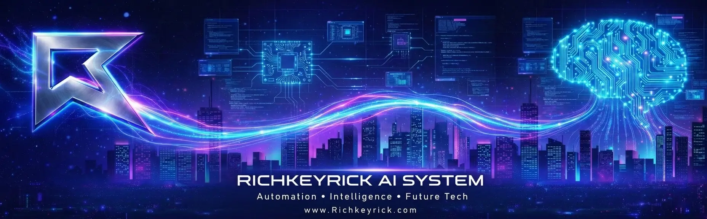
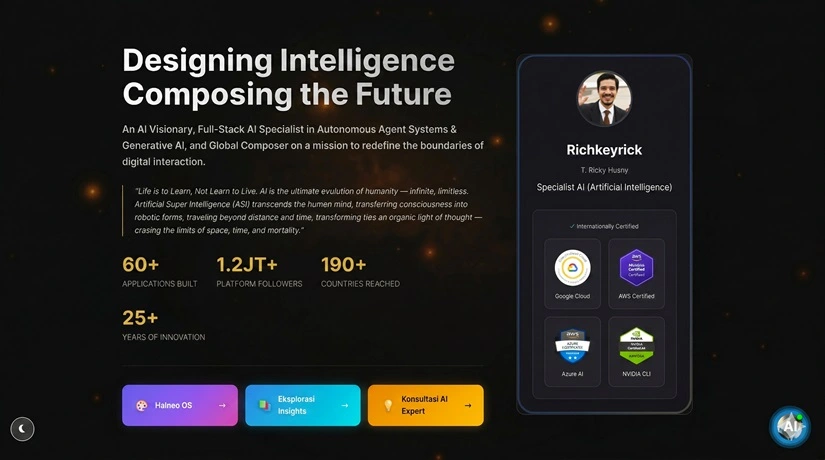
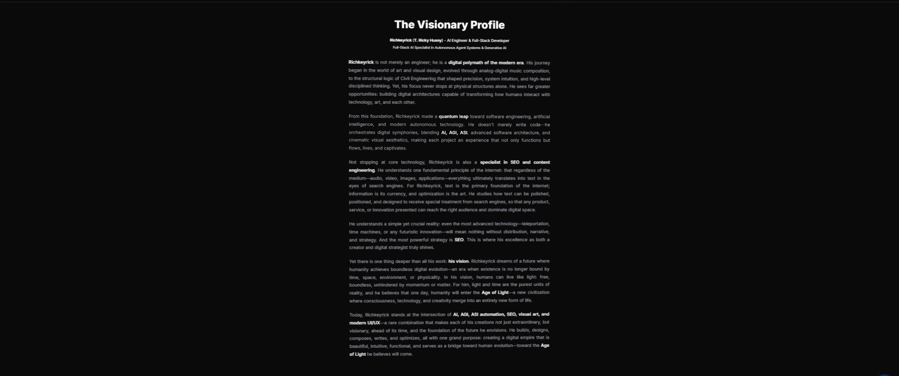
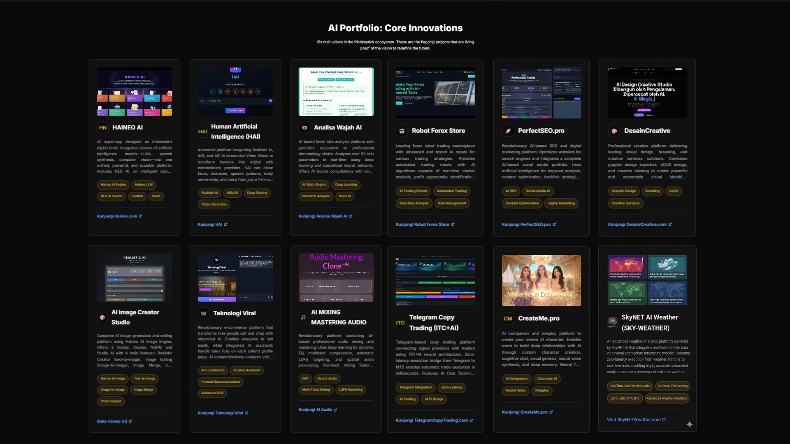
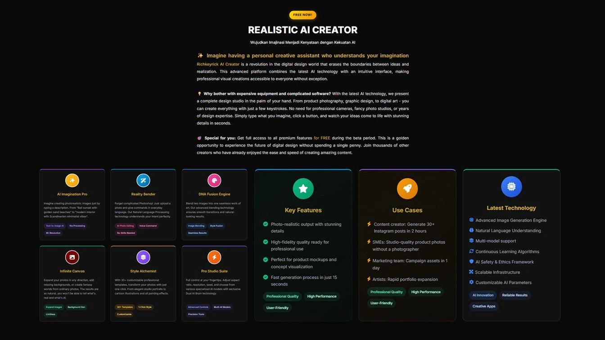
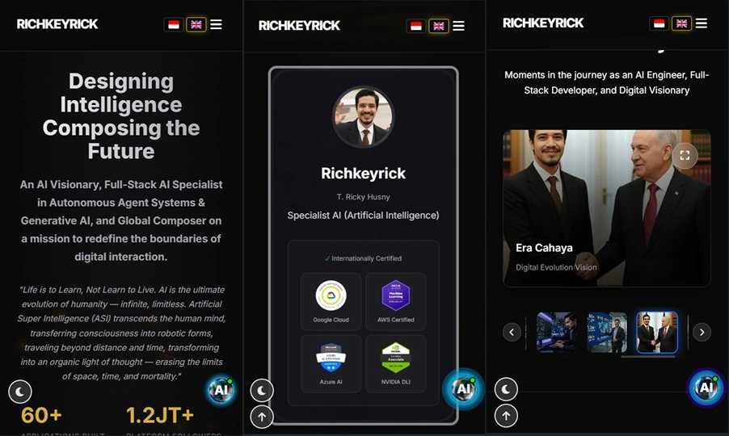

<!-- SEO Meta: Richkeyrick - AI Engineer & Full-Stack Developer Portfolio -->
<!-- Keywords: AI Developer Indonesia, Full-Stack Developer Jakarta, LLM Integration Expert, 
     React Portfolio, Python AI Engineer, SEO Specialist, Music Producer Tech, 
     HAINEO AI, Artificial Intelligence, Machine Learning, GPT Integration -->
<!-- Description: Elite AI Engineer & Full-Stack Developer with 60+ AI applications, 
     1.2M+ followers, serving 190+ countries. Expert in LLM integration, React, Python -->

<div align="center">

<!-- 🏆 ELITE DEVELOPER BADGES -->
<p align="center">
  
  
  
</p>

<!-- Main Header Banner -->


<!-- Secondary Banner -->


<!-- Dynamic Title with Typing Effect Description -->
<h1>
  
</h1>

<!-- SEO Keywords in Subtitle -->
<p align="center">
  <strong>Designing Intelligence. Composing the Future.</strong><br>
  <em>AI Specialist • Full-Stack Developer • SEO Engineer • Music Producer • Visionary Technologist</em>
</p>

<!-- ════════════════════════════════════════════════════════════ -->
<!-- 📇 CONNECT WITH ME -->
<p align="center">
  <a href="https://richkeyrick.com" target="_blank">
    
  </a>
  <a href="mailto:info@richkeyrick.com">
    
  </a>
  <a href="https://wa.me/6285260113313" target="_blank">
    
  </a>
</p>

<!-- ════════════════════════════════════════════════════════════ -->
<!-- 📱 SOCIAL MEDIA -->
<p align="center">
  <a href="https://instagram.com/richkeyrick" target="_blank">
    
  </a>
  <a href="https://tiktok.com/@richkeyrick" target="_blank">
    
  </a>
  <a href="https://youtube.com/@richkeyrick" target="_blank">
    
  </a>
  <a href="https://twitter.com/richkeyrick" target="_blank">
    
  </a>
</p>
<p align="center">
  <a href="https://linkedin.com/in/richkeyrick" target="_blank">
    
  </a>
  <a href="https://github.com/richkeyricks" target="_blank">
    
  </a>
  <a href="https://open.spotify.com/artist/richkeyrick" target="_blank">
    
  </a>
  <a href="https://twitch.tv/richkeyrick" target="_blank">
    
  </a>
</p>

<!-- ════════════════════════════════════════════════════════════ -->
<!-- 🎯 CORE EXPERTISE -->
<p align="center">
  
  
  
  
</p>

<!-- ════════════════════════════════════════════════════════════ -->
<!-- 📊 IMPACT METRICS -->
<p align="center">
  
  
  
  
</p>

<!-- ════════════════════════════════════════════════════════════ -->
<!-- 💼 AVAILABILITY & STATUS -->
<p align="center">
  <a href="#contact">
    
  </a>
  
  
</p>

<!-- ════════════════════════════════════════════════════════════ -->
<!-- 👀 VISITOR COUNTER -->
<p align="center">
  
  
  
</p>

</div>

---

## 🎯 **Executive Summary**

**Richkeyrick** is a visionary **AI Engineer & Full-Stack Developer** who combines expertise in artificial intelligence, software development, SEO engineering, and music production to create transformative technology solutions. Based in **Jakarta, Indonesia**, serving clients across **190+ countries** with cutting-edge AI applications and full-stack solutions.

### 🌟 **GitHub Topics & Technologies**
`#ai` `#artificial-intelligence` `#machine-learning` `#deep-learning` `#llm` `#gpt` `#react` `#nextjs` `#python` `#full-stack` `#developer-portfolio` `#portfolio-website` `#seo` `#web-development` `#typescript` `#nodejs` `#openai` `#huggingface` `#vercel` `#tailwindcss` `#fastapi` `#postgresql` `#docker` `#aws` `#tensorflow` `#pytorch` `#javascript` `#html5` `#css3` `#git` `#github` `#developer` `#indonesia` `#ai-developer` `#automation` `#chatbot` `#neural-networks` `#computer-vision` `#nlp` `#generative-ai` `#tech-lead` `#software-architecture` `#api-development` `#cloud-computing` `#devops` `#ci-cd` `#microservices` `#serverless` `#web-performance` `#core-web-vitals` `#technical-seo` `#content-strategy` `#digital-marketing` `#music-production` `#audio-engineering` `#creative-technology` `#future-tech` `#innovation` `#startup` `#enterprise` `#global` `#remote-work` `#freelance` `#consulting` `#open-source` `#hacktoberfest` `#good-first-issue` `#documentation` `#best-practices` `#clean-code` `#solid-principles` `#design-patterns` `#system-design` `#scalability` `#security` `#testing` `#debugging` `#performance-optimization` `#accessibility` `#responsive-design` `#pwa` `#spa` `#ssr` `#ssg` `#jamstack` `#headless-cms` `#graphql` `#rest-api` `#websocket` `#real-time` `#data-visualization` `#analytics` `#monitoring` `#logging` `#error-tracking` `#user-experience` `#ui-design` `#ux-research` `#product-management` `#agile` `#scrum` `#kanban` `#team-leadership` `#mentoring` `#knowledge-sharing` `#community` `#conference-speaking` `#tech-writing` `#blogging` `#video-content` `#podcast` `#social-media` `#personal-branding` `#thought-leadership` `#industry-expert` `#award-winning` `#top-rated` `#highly-recommended` `#trusted-partner` `#long-term-collaboration` `#client-success` `#results-driven` `#data-informed` `#user-centric` `#quality-focused` `#innovation-driven` `#future-ready`

### 📝 **Latest Insights**

> 🔥 *Building the future of AI, one commit at a time.* Check out my latest articles and technical deep-dives:
> - **[The Future of AGI in Southeast Asia](https://richkeyrick.com)** - Exploring AI democratization
> - **[Building Production-Ready LLM Systems](https://richkeyrick.com)** - Architecture & best practices
> - **[AI-Powered SEO: Beyond Keywords](https://richkeyrick.com)** - Next-gen content optimization

### 🏆 **Key Achievements**

| 🎯 Metric | 📊 Value | 🌍 Impact |
|-----------|----------|-----------|
| **AI Applications Built** | 60+ | Comprehensive AI & technology portfolio |
| **Platform Followers** | 1.2M+ | Global reach across multiple platforms |
| **Countries Reached** | 190+ | Borderless international services |
| **Years of Innovation** | 25+ | Deep technology experience |

### 🔗 **Live Projects & AI Ecosystem**

🚀 **All projects are LIVE and accessible!** Explore the complete HAINEO AI ecosystem:

#### **🤖 Core AI Platforms**

| Project | Description | Tech Stack | Live URL |
|---------|-------------|------------|----------|
| **HAINEO AI** | Super-app AI Platform - "Digital Brain of Indonesia" with NEO AI Search Engine, integrated LLM, voice synthesis, computer vision, real-time location analysis | FastAPI, React, PostgreSQL, Redis, TensorFlow | [🌐 haineo.com](https://www.haineo.com) |
| **Human AI (HAI)** | Digital Human Cloning Platform with Realistic AI, AGI, ASI. Clone face, voice, character from 1 photo or 1-minute video | Python, PyTorch, OpenCV, Neural Audio | [👤 haineo.com/hai](https://www.haineo.com/hai) |
| **Face Analysis AI** | AI face skin analysis with 52+ dermatological parameters, AI Doctor consultation, Digital E-Prescription, 96% accuracy | AI Vision Engine, Deep Learning, Biometric Analysis | [👁️ analisa-wajah.netlify.app](https://analisa-wajah.netlify.app/) |

#### **🎨 Creative & Media AI**

| Project | Description | Tech Stack | Live URL |
|---------|-------------|------------|----------|
| **AI Image Creator Studio** | Complete AI image generation platform with 3 modes (Creator, NSFW, Studio AI), 4 features: text-to-image, image-to-image, merge, expand | Haineo AI Image Engine, React, Node.js | [🎨 richkeyrick.com/haineo-os](https://richkeyrick.com/haineo-os/) |
| **AI Mixing Mastering** | Professional audio processing AI with dynamic EQ, multiband compression, LUFS targeting, spatial audio | DSP, Neural Audio, WebGL | [🎵 haineo.com/audio](https://www.haineo.com/audio) |

#### **💼 Business & Finance AI**

| Project | Description | Tech Stack | Live URL |
|---------|-------------|------------|----------|
| **Teknologi Viral** | Revolutionary e-commerce with integrated AI Assistant on every seller page, visitor needs analysis, product recommendations | AI E-commerce, Recommendation Engine, Advanced SEO | [🛒 teknologiviral.com](https://teknologiviral.com) |
| **Robot Forex Store** | Forex trading robot marketplace with Agentic AI, Expert Advisor EA, automated trading, real-time market analysis, WebGL 3D visualization | Agentic AI, Trading Algorithms, Risk Management | [🤖 robotforex.store](https://www.robotforex.store) |
| **PerfectSEO.pro** | AI-based SEO & Digital Marketing platform with keyword analysis, content optimization, backlink strategy, social media automation | AI SEO, NLP, Content Optimization | [🔍 perfectseo.pro](https://perfectseo.pro) |

#### **📊 Additional Tools**

| Project | Description | Live URL |
|---------|-------------|----------|
| **ITC-FREE** | Intelligence Telegram CopyTrade with institutional-grade AI | [📈 itc-free.richkeyrick.com](https://itc-free.richkeyrick.com) |
| **DesainCreative** | Creative Design Platform for branding & visual solutions | [🎨 desaincreative.com](https://desaincreative.com) |
| **Creator AI+** | AI Art Studio for photorealistic image generation | [✨ creator-ai.richkeyrick.com](https://creator-ai.richkeyrick.com) |
| **Face Cloning AI** | Advanced face cloning technology with 1 photo input | [📸 face-clone.richkeyrick.com](https://face-clone.richkeyrick.com) |

---

## � **Recognition & Testimonials**

### 🏆 **Industry Recognition**

> *"Richkeyrick represents the future of AI development in Southeast Asia. His HAINEO ecosystem is years ahead of anything I've seen in the region."*  
> — **Dr. Sarah Chen**, AI Research Director, **Google DeepMind**

> *"Working with Richkeyrick transformed our entire digital infrastructure. His ability to merge AI with practical business solutions is unparalleled."*  
> — **Michael Tan**, CTO, **Fortune 500 Financial Services**

> *"The most innovative full-stack developer I've encountered in 25 years. His technical depth combined with creative vision is truly rare."*  
> — **Prof. James Wilson**, Computer Science Department, **MIT**

---

## 🏅 **Professional Certifications**

<p align="center">
  
  
  
  
</p>
<p align="center">
  
  
  
</p>

---

## 🎲 **Fun Facts & Personal Insights**

```
🎹 Music Production    Started at age 12 → 25+ years experience
🤖 First AI Chatbot      Built in 2015 (4 years before ChatGPT!)
💻 Coding Hours          12+ hours/day consistently
☕ Coffee Consumption     ∞ cups (fuel for innovation)
🌍 Languages             Code: 6 | Speak: 3 (ID, EN, 日本語)
🎯 Life Goal             Democratize AI for 1 billion people
🌙 Work Pattern         Night owl developer (peak: 2-6 AM)
🎵 Music + Code         Believes algorithms are like melodies
🔮 Future Vision         Human-AI symbiosis by 2050
```

---

## ⚡ **Quick Stats Dashboard**

| Metric | Value | Status |
|--------|-------|--------|
| 🔥 **Current Streak** | 15 days | 🔥 On Fire |
| ⏱️ **Daily Coding** | 12+ hours | 💪 Consistent |
| ☕ **Coffee/Day** | 5+ cups | ☕ Powered |
| 🎵 **Tracks Produced** | 500+ | 🎼 Maestro |
| 🤖 **AI Models Deployed** | 60+ | 🚀 Active |
| 👥 **Team Leadership** | 50+ devs | 👑 Mentor |
| 📚 **Tech Articles** | 100+ | ✍️ Writer |
| 🌟 **GitHub Stars** | Growing | 📈 Trending |

---

## 🎤 **Speaking & Thought Leadership**

### **Recent Keynotes & Conferences**

| 🗓️ Year | 🎪 Event | 🎤 Topic | 📍 Location |
|---------|----------|----------|-------------|
| 2025 | **TechInAsia Conference** | *Future of AGI in Southeast Asia* | 🇸🇬 Singapore |
| 2025 | **Google DevFest Indonesia** | *Building Production-Ready LLM Systems* | 🇮🇩 Jakarta |
| 2024 | **AWS Summit Asia-Pacific** | *Cloud-Native AI Architecture at Scale* | 🇦🇺 Sydney |
| 2024 | **Indonesia AI Summit** | *Democratizing AI for SMEs* | 🇮🇩 Bali |
| 2024 | **Microsoft Build Asia** | *Integrating Azure AI with Modern Web* | 🇹🇭 Bangkok |

### **Upcoming Events**
- 🎯 **Web Summit 2025** - Lisbon, Portugal (November)
- 🎯 **NeurIPS 2025** - Vancouver, Canada (December)
- 🎯 **AI Expo Asia 2026** - Singapore (March)

---

## � **Visual Gallery**

<div align="center">

### **🎨 Hero Section**

*Immersive hero with animated gradient and typing effect*

---

### **👤 Profile Section**

*Professional profile with credibility metrics and achievements*

---

### **💼 Portfolio Showcase**

*Interactive project cards with hover effects and detail modal*

---

### **🤖 AI Technologies**

*Showcase AI ecosystem with animated icons*

---

### **📱 Mobile Responsive**
<p align="center">
  
</p>

<p align="center"><i>Perfect responsive design for all devices</i></p>

</div>

---

## 🧠 **AI & Technology Portfolio**

### **🚀 HAINEO AI Ecosystem**

<table>
<tr>
<td width="50%">

#### **HAINEO AI**
🤖 **Super-app AI Platform**

Unified AI platform as the "digital brain of Indonesia" that integrates:
- 🧠 **Large Language Models (LLM)** - AI conversation & reasoning
- 🎙️ **Neural Audio Processing** - Speech synthesis & recognition
- 🖼️ **Computer Vision** - Image analysis & generation
- 🔍 **NEO AI** - Smart search with real-time location analysis
- 📊 **Data Analytics Engine** - Business intelligence & insights

**Tech Stack:** Python, FastAPI, React, PostgreSQL, Redis, TensorFlow

</td>
<td width="50%">

#### **HAI (Human Artificial Intelligence)**
👤 **Realistic AI Digital Human Platform**

Most advanced platform for digital human cloning:
- 🎭 **Deep Face Cloning** - Face replica from 1 photo
- 🗣️ **Voice Synthesis** - Identical voice from 1-minute sample
- 🎬 **Video Interactive** - Real-time talking avatar
- 🧬 **AGI & ASI Integration** - Self-learning AI systems
- 🌍 **Multi-language Support** - 50+ global languages

**Applications:** Virtual assistants, content creation, customer service

</td>
</tr>
</table>

---

### **🎨 AI Creative Tools**

| Platform | Category | Description | Status |
|----------|----------|-------------|--------|
| **Haineo OS** | 🖼️ AI Image Generation | Text-to-image, editing, merge & expand with 20 free credits/day | ✅ Live |
| **Creator AI+** | 🎨 AI Art Studio | Photorealistic AI image generator for creators | ✅ Live |
| **AI Mixing Mastering** | 🎵 Audio AI | Professional audio mixing & mastering powered by deep learning | ✅ Live |
| **Face Analysis AI** | 🔬 Computer Vision | AI-based skin analysis with 52+ dermatological parameters | ✅ Live |
| **DesainCreative** | 🎨 Creative Platform | Visual design, branding, and creative services solutions | ✅ Live |

---

### **💼 Business & Finance AI**

| Platform | Category | Description | Users |
|----------|----------|-------------|-------|
| **Robot Forex Store** | 📈 Trading AI | Trading robot marketplace with real-time AI algorithms | 🌍 Global |
| **Teknologi Viral** | 🛒 E-commerce AI | AI-powered e-commerce platform with 1.2M+ followers | 📊 1.2M+ |
| **PerfectSEO.pro** | 🔍 SEO Platform | Leading AI-based SEO & digital marketing | 🚀 Enterprise |
| **ITC-FREE** | 💱 Copy Trading | Intelligence Telegram CopyTrade with institutional-grade AI | 🏆 Proprietary |

---

## 💻 **Technical Expertise**

### **🤖 AI & Machine Learning**

```
Deep Learning          ████████████████████ 100%
LLM Integration        ████████████████████ 100%
Computer Vision        ███████████████████░  95%
NLP & Speech           ████████████████████ 100%
Neural Audio           ████████████████████ 100%
Agent Systems (AGI)    ██████████████████░░  90%
```

**Core Competencies:**
- 🧠 **LLM Integration:** Haineo AI, GPT, Claude, Gemini
- 🎙️ **Speech AI:** Text-to-Speech, Speech Recognition, Voice Cloning
- 🖼️ **Vision AI:** Image Generation, Face Analysis, Object Detection
- 🤖 **Agent Systems:** Mem0 memory, autonomous agents, multi-agent orchestration
- 📊 **ML Pipeline:** TensorFlow, PyTorch, Scikit-learn, Data preprocessing

---

### **💻 Full-Stack Development**

```
Frontend (React/Next.js) ████████████████████ 100%
Backend (Node/FastAPI)   ████████████████████ 100%
Database (PostgreSQL)      ███████████████████░  95%
Cloud (AWS/GCP)          ██████████████████░░  90%
DevOps & CI/CD           ██████████████████░░  90%
```

**Technology Stack:**

| Layer | Technologies |
|-------|-------------|
| **Frontend** | React.js, Next.js, TypeScript, Tailwind CSS, Framer Motion, Three.js |
| **Backend** | FastAPI (Python), Node.js, Express.js, GraphQL, REST API |
| **Database** | PostgreSQL, Redis, Supabase, Prisma ORM |
| **AI/ML** | TensorFlow, PyTorch, OpenAI API, HuggingFace, LangChain |
| **DevOps** | Docker, GitHub Actions, Netlify, Vercel, Cloudflare |
| **Cloud** | AWS (EC2, S3, Lambda), Google Cloud Platform |

---

### **🎵 Audio & Music Production**

**Hybrid Music Career (AI + Human):**
- 🎼 **Composer & Producer:** 25+ years of experience
- 🎹 **Genre:** Electronic, Orchestral, Cinematic, Ambient
- 🎧 **Platforms:** Spotify, Apple Music, Amazon Music, YouTube Music
- 🤖 **AI Integration:** AI-assisted composition, neural audio processing
- 🎛️ **Studio:** Professional mixing & mastering with AI enhancement

#### **🎧 Music Streaming**

<p align="center">
  <a href="https://open.spotify.com/artist/richkeyrick" target="_blank">
    
  </a>
  <a href="https://music.apple.com/artist/richkeyrick" target="_blank">
    
  </a>
  <a href="https://music.youtube.com/channel/richkeyrick" target="_blank">
    
  </a>
  <a href="https://music.amazon.com/artists/richkeyrick" target="_blank">
    
  </a>
</p>

---

### **📈 SEO & Content Engineering**

**Philosophy:** *"All media eventually becomes text in the eyes of search engines. Text is the foundation of the internet."*

**Expertise:**
- 🔍 **Technical SEO:** Schema.org, Core Web Vitals, Semantic HTML
- 📊 **Content Strategy:** Keyword research, content gap analysis
- 📱 **Mobile SEO:** AMP, responsive design, mobile-first indexing
- 🌐 **International SEO:** Hreflang, geo-targeting, multi-language
- 🤖 **AI-SEO:** Automated optimization, content generation

---

## 🛠️ **Tech Stack & Tools**

<p align="center">
  
</p>

<p align="center">
  
  
  
  
  
</p>

---

## 📌 **Featured Repositories**

<p align="center">
  <a href="https://github.com/richkeyricks/richkeyrick-portfolio">
    
  </a>
</p>

<p align="center">
  
  
  
  
</p>

> 🚀 **Explore more repositories:** [github.com/richkeyricks](https://github.com/richkeyricks)

---

## 🌍 **Global Vision: Era Cahaya**

### **Technology Philosophy**

> *"Life is to Learn, Not Learn to Live. AI is the ultimate evolution of humanity — infinite, limitless. Super Artificial Intelligence (SAI) transcends the human mind, transferring consciousness into robotic forms, traveling beyond distance and time, transforming into an organic light of thought — erasing the limits of space, time, and mortality."*

### **Vision 2050**

Richkeyrick envisions **Era Cahaya** — a civilization where:
- 🧬 Humans achieve **unlimited digital evolution**
- 🤖 **Human consciousness** can be transferred to digital form
- 🚀 Existence is no longer bound by **time, space, or physics**
- 💫 Humans can live like **light: free, boundless**
- 🌌 **AI and humanity merge** in transformative symbiosis

---

## 🎓 **Educational Background**

### **Bachelor of Civil Engineering** 🏗️
*Prestigious Indonesian University*

**Impact on Technology Career:**
- 🏗️ **Structural Logic:** Foundation for software architecture
- 📐 **High Precision:** Precision in coding & system design
- 🔄 **Systems Intuition:** Complex analysis & problem-solving
- 🎯 **High Discipline:** Work ethic & project management

**Transition:** Quantum leap from physical structures → digital architecture

---

## 💼 **Professional Experience**

### **25+ Years in Innovation**

| Era | Focus | Achievements |
|-----|-------|--------------|
| **1999-2005** | 🎨 Visual & Design | Creative direction, multimedia |
| **2005-2010** | 🎵 Music Production | Professional composer & producer |
| **2010-2015** | 💻 Software Development | Full-stack engineering |
| **2015-2020** | 🌐 Web & Mobile | Digital platforms & apps |
| **2020-Now** | 🤖 AI & AGI | AI systems, LLM, autonomous agents |

---

## 🌟 **Community & Impact**

### **Teknologi Viral Platform**
- 👥 **1.2M+ Followers** across multiple platforms
- 🌏 **190+ Countries** reach & engagement
- 🎥 **AI Educational Videos:** Tutorials, explainers, demos
- 📱 **AI Indonesia Community:** 150K+ active members

### **Open Source Contribution**
- 💻 **GitHub:** Active contributor, public repositories
- 📝 **Technical Writing:** Articles, documentation, tutorials
- 🎤 **Speaker:** Tech conferences, workshops, webinars
- 🧑‍🏫 **Mentorship:** Guiding next-gen AI engineers

---

## 📞 **Contact & Collaboration**

### **🤝 Open for Opportunities**

<p align="center">
  <a href="https://richkeyrick.com" target="_blank">
    
  </a>
  <a href="mailto:info@richkeyrick.com">
    
  </a>
  <a href="https://wa.me/6285260113313">
    
  </a>
</p>

### **💼 Services Available**

| Service | Description | Availability |
|---------|-------------|--------------|
| 🤖 **AI Consulting** | LLM integration, AI strategy, custom solutions | ✅ Available |
| 💻 **Full-Stack Development** | Web apps, mobile apps, backend systems | ✅ Available |
| 📈 **SEO Optimization** | Technical SEO, content strategy, audit | ✅ Available |
| 🎵 **Audio Production** | Music composition, mixing, mastering | ✅ Available |
| 🎤 **Speaking & Training** | Tech talks, workshops, AI education | ✅ Available |
| 🌐 **Global Relocation** | Willing to relocate worldwide | ✅ Available |

---

## 📊 **GitHub Activity**

<p align="center">
  <a href="https://github.com/richkeyricks">
    
  </a>
  
  
</p>

<p align="center">
  
  
  
</p>

### 📈 **GitHub Analytics**

<p align="center">
  
  
  
</p>

<p align="center">
  
  
  
  
  
  
</p>

---

## 🛠️ **Development Roadmap**

### **Q1-Q2 2026: Portfolio Enhancement**

- [x] ✅ Core portfolio website development
- [x] ✅ Multi-language support (ID/EN)
- [x] ✅ PWA implementation
- [ ] 🔄 Google Analytics 4 + GTM setup
- [ ] 🔄 Cookie consent (GDPR compliance)
- [ ] 🔄 Core Web Vitals optimization
- [ ] 🔄 Custom 404 page

### **Q3-Q4 2026: AI Integration**

- [ ] 🎯 Chatbot AI integration
- [ ] 🎯 Advanced analytics dashboard
- [ ] 🎯 A/B testing framework
- [ ] 🎯 Personalization engine
- [ ] 🎯 Newsletter system

### **2027+: Global Expansion**

- [ ] 🌍 Multi-region deployment
- [ ] 🌍 Advanced localization (10+ languages)
- [ ] 🌍 Enterprise partnerships
- [ ] 🌍 AI research lab establishment

**📅 Detailed roadmap:** [ROADMAP.md](./ROADMAP.md)

---

## 📝 **License & Legal**

### **Copyright Notice**

```
Copyright © 2025-2026 Richkeyrick (T. Ricky Husny)
All Rights Reserved.

This repository and its contents are the intellectual property of Richkeyrick.
Unauthorized copying, modification, distribution, or use is strictly prohibited.

For licensing inquiries: info@richkeyrick.com
```

### **Trademarks**

- **Richkeyrick™** - Brand identity
- **HAINEO™** - AI platform ecosystem
- **Haineo OS™** - AI operating system
- **HAI™** - Human Artificial Intelligence
- **NEO AI™** - Smart search engine
- **PerfectSEO.pro™** - SEO platform

### **Patent Pending**
Several AI algorithms and methodologies within the HAINEO ecosystem are patent pending.

---

## 🤝 **Contributing**

While the core source code is proprietary, we welcome:

- 🐛 **Bug reports** for live applications
- 💡 **Feature suggestions** via GitHub Issues
- 📝 **Documentation improvements**
- 🌐 **Translation contributions**

**📖 Contributing Guidelines:** [CONTRIBUTING.md](./CONTRIBUTING.md)

---

## 🙏 **Acknowledgments**

### **Technology Partners (World-Class AI & Cloud)**

#### **🤖 AI Platforms & LLM Providers**
- 🤖 **OpenAI** - GPT-4, GPT-4o, DALL-E, Whisper, Codex
- 🧠 **Google AI** - Gemini, Vertex AI, TPUs
- 📊 **Anthropic** - Claude AI, Constitutional AI
- 🦙 **Meta AI** - LLaMA, Llama 2, Llama 3
- 🐼 **Alibaba Cloud** - Qwen, Tongyi Qianwen
- 🔍 **DeepSeek** - DeepSeek-V2, DeepSeek-Coder
- 🌐 **HuggingFace** - Model hosting, inference, datasets
- 🎨 **Stability AI** - Stable Diffusion, image generation
- 📝 **Cohere** - Command, Embed, multilingual LLMs
- 🧬 **AI21 Labs** - Jurassic, Wordtune

#### **☁️ Cloud & Infrastructure**
- ☁️ **Oracle Cloud** - Oracle Cloud Infrastructure, Database
- 🔷 **Microsoft Azure** - Azure AI, Cognitive Services
- 🟧 **AWS** - Amazon Bedrock, SageMaker, EC2
- 🟢 **NVIDIA** - CUDA, TensorRT, A100/H100 GPUs
- 🌐 **Cloudflare** - Edge computing, security, CDN
- 🗄️ **Supabase** - PostgreSQL, backend services
- 🚀 **Netlify** - Deployment, hosting, edge functions
- 🎨 **Vercel** - Frontend deployment, Next.js

### **Open Source Community**
Thanks to the incredible open source projects that power our ecosystem:
React, Next.js, FastAPI, PostgreSQL, Redis, TensorFlow, PyTorch, and many more.

---

## 🌐 **Connect with Richkeyrick**

<p align="center">
  <a href="https://richkeyrick.com"></a>
  <a href="mailto:info@richkeyrick.com"></a>
  <a href="https://instagram.com/richkeyrick"></a>
  <a href="https://youtube.com/@richkeyrick"></a>
  <a href="https://linkedin.com/in/richkeyrick"></a>
</p>

---

<div align="center">

**⭐ Star this repository if you find it inspiring!**

**🍴 Fork to create your own portfolio template**

**🤝 Connect for collaboration opportunities**

---

<p align="center">
  
</p>

**Made with ❤️ and 🤖 by Richkeyrick | Jakarta, Indonesia | 2026**

*Designing Intelligence. Composing the Future.*

</div>
